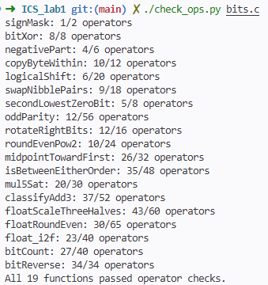
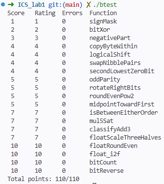

# Lab 1：Data Lab 实验报告

- **姓名**：宋梓程
- **学号**：24307130096
---

## 一、 实验测试运行结果截图

### 1.1 操作符规则检查 (`./check_ops.py bits.c`)

### 1.2 正确性与得分测试 (`./btest`)

---

## 二、 各函数关键思路

### P1: `signMask`

将 `1` 左移 31 位，得到仅符号位为 1 的掩码。

### P2: `bitXor`

将异或拆成“仅一方为 1”的两种情况，再用德·摩根定律把或运算改写为取反和与运算。

### P3: `negativePart`

用 `x >> 31` 生成符号掩码，与补码取反加一的结果相与：负数保留取负结果，非负数清零。

### P4: `copyByteWithin`

通过移位和 `0xFF` 提取源字节，清空目标字节后，将源字节移到目标位置并用或运算合并。

### P5: `logicalShift`

算术右移后，用 `~(((1 << 31) >> n) << 1)` 清除高位的符号扩展；该掩码也适用于 `n = 0`。

### P6: `swapNibblePairs`

构造 `0x0F0F0F0F` 掩码，分别提取每个字节的低、高 4 位，反向移动 4 位后合并。

### P7: `secondLowestZeroBit`

先用 `x | (x + 1)` 将最低的 0 位填为 1，再用 `(~temp) & (temp + 1)` 提取新的最低 0 位，即原数的次低 0 位。

### P8: `oddParity`

依次右移 16、8、4、2、1 位并异或，将所有位的奇偶性折叠到最低位，再取反实现偶数个 1 返回 1、奇数个 1 返回 0。

### P9: `rotateRightBits`

用 `n & 31` 将移位量限制在 0–31，将逻辑右移部分与左移回填部分合并。左移量也按 32 取模，避免移位 32 位。

### P10: `roundEvenPow2`

商为偶数时取“半程值减 1”作为偏置，商为奇数时取半程值。将偏置加到 `x` 后右移再左移，使半程情况舍入到偶数商。

### P11: `midpointTowardFirst`

分别右移两数并补上低位贡献，得到向下取整的中点，避免直接相加溢出。若两数奇偶不同且 `x > y`，再加 1，使结果向 `x` 舍入；比较时结合符号与同号差值判断。

### P12: `isBetweenEitherOrder`

分别判断 `x > a` 和 `x > b`，两者异或为 1 表示位于端点之间，再补充与任一端点相等的情况。比较时区分同号与异号，避免差值溢出影响结果。

### P13: `mul5Sat`

用 `(x << 2) + x` 计算五倍，检查原数高 3 位是否同符号及结果符号是否变化。发生溢出时，用符号掩码选择 `INT_MAX` 或 `INT_MIN`。

### P14: `classifyAdd3`

分两次相加，根据操作数和结果的符号检测正、负溢出。用正溢出次数减去负溢出次数，按差值符号返回 1、-1 或 0。

### P15: `floatScaleThreeHalves`

拆分符号、阶码和尾数，将有效数字乘以 3，再根据规格化需要右移 1 或 2 位，并向最近偶数舍入。保留符号，NaN 和无穷大原样返回，阶码溢出时返回无穷大。

### P16: `floatRoundEven`

根据阶码确定小数位范围，比较被截去部分与半程值；超过半程时进位，恰好半程时仅在保留部分为奇数时进位。单独处理绝对值小于 1 的情况并保留零的符号，整数、NaN 和无穷大原样返回。

### P17: `float_i2f`

用无符号数处理绝对值，定位最高有效 1 位以确定阶码，再保留 24 位有效数字。根据丢弃位向最近偶数舍入，若进位导致有效数字溢出则增加阶码，零单独处理。

### P18: `bitCount`

构造分组掩码，依次统计每 2、4、8、16、32 位中 1 的个数，通过分治累加得到总数。

### P19: `bitReverse`

构造分组掩码，依次交换相邻的 1、2、4、8、16 位块，完成 32 位的整体逆序。

---

## 三、 参考资料与引用

1. **Randal E. Bryant, David R. O'Hallaron**, 《深入理解计算机系统》（*Computer Systems: A Programmer's Perspective*, 3rd Edition）, 第 2 章：信息的表示和处理。
2. **IEEE Standard for Floating-Point Arithmetic (IEEE 754-2008 / IEEE 754-2019)**：单精度浮点数编码标准、规格化与非规格化数定义及向最近偶数舍入规范。
3. **Sean Eron Anderson**, *Bit Twiddling Hacks*, Stanford University: 学习了二分法位计数与位翻转算法思想。
4. **Henry S. Warren, Jr.**, 《高效算法：绝妙的位操作》（*Hacker's Delight*, 2nd Edition）: 参考了无分支整数溢出检测与向下/向上舍入的偏差设计。
---

## 四、 实验感受与收获

1. **对补码与底层整型表示的深刻理解**：
   日常高级语言编程中往往忽略整型的底层表示，而在本实验严苛的操作符限制下，必须深入到补码的每一位思考——例如利用算术右移生成全 0 或全 1 掩码替代 `if-else` 分支，利用德·摩根定律消除对特定逻辑符的依赖。
2. **掌握了无分支编程技术**：
   在类似 `classifyAdd3` 和 `midpointTowardFirst` 的题目中，通过两两相加的符号位分析溢出，避免了条件分支带来的流水线预测开销，对计算机底层执行效率有了更立体的认识。
3. **浮点数 IEEE 754 规范的落地实践**：
   浮点数题目（尤其是向最近偶数舍入、非规格化数平滑过渡到规格化数）极具挑战性。通过亲自分离阶码、尾数并手动处理边界舍入进位，加深了对浮点精度损失与舍入机制的理解。